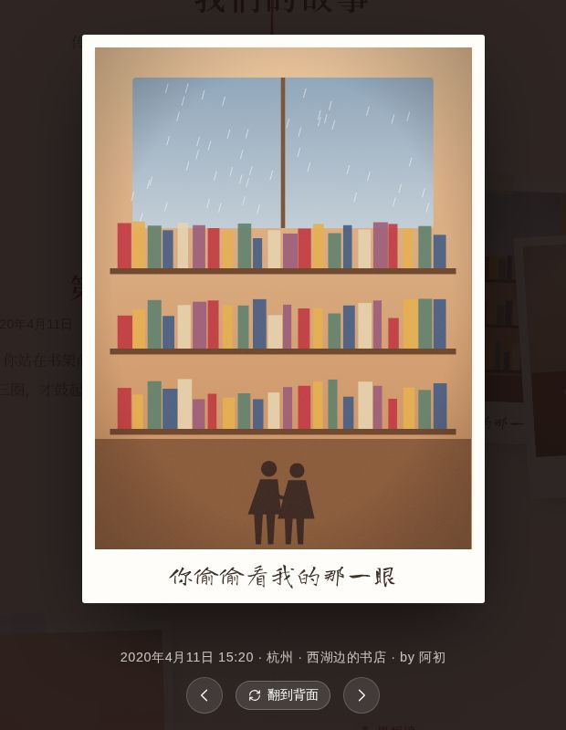
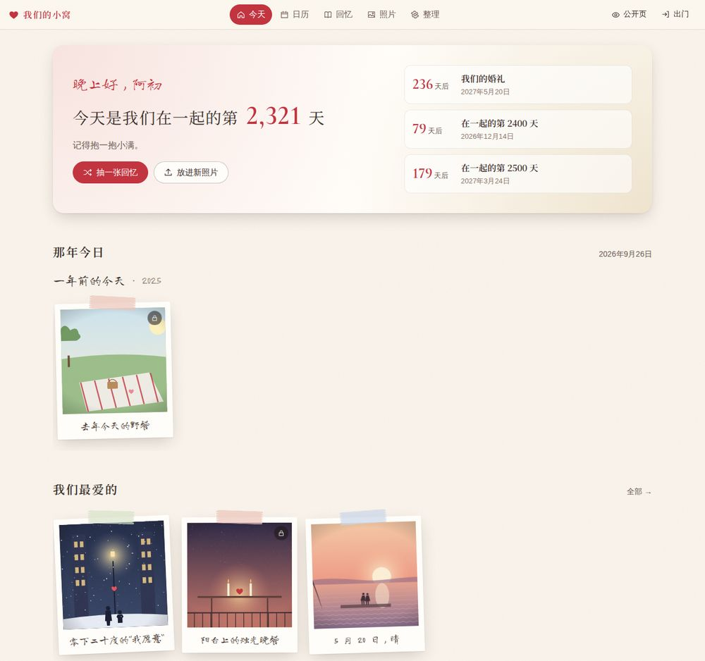
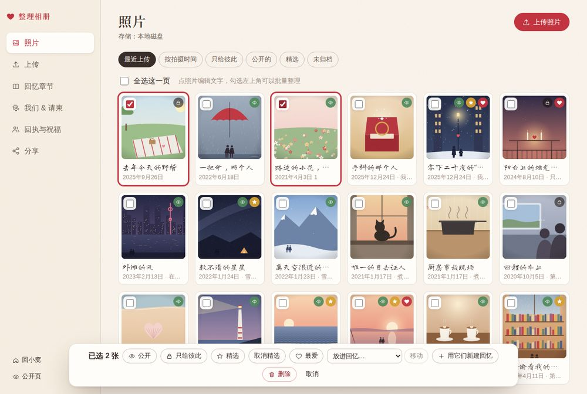
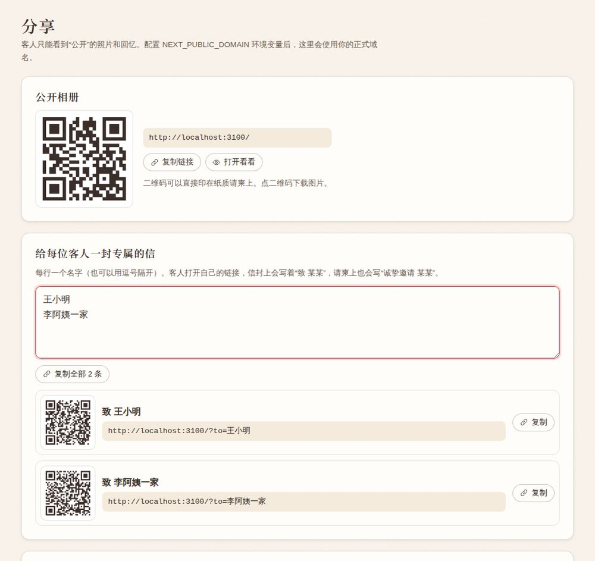

# 红线 · 我们的相册

> 传说月下老人会用一根看不见的红线，把注定的两个人系在一起。
> 这本相册，就是那根红线上打过的每一个结。

一本会讲故事的恋爱相册：平时是只属于两个人的小窝，放满一起出去玩、一起过日子的照片；
到了结婚那天，它就是婚礼请柬里的那一页——客人拆开一封写着自己名字的信，顺着红线读完你们的故事，
在最后写下祝福、告诉你们会不会来。

照片存储和部署方式沿用 [exif-photo-blog](https://github.com/sambecker/exif-photo-blog)：
Next.js + Postgres + Vercel Blob / Cloudflare R2 / AWS S3 / MinIO，环境变量名也一样；
另外加了阿里云 OSS / 腾讯云 COS 等 S3 兼容存储和 Docker 单机部署，方便国内访问。

<p>
  
  
</p>


---

## 它能做什么

### 给客人看的那一面（`/`）

| | |
|---|---|
| **一封写着名字的信** | 打开相册先看到一封盖着火漆的信。用专属链接 `/?to=王小明` 打开，信封上写着“致 王小明”，请柬里写着“诚挚邀请 王小明”。轻触火漆：信封打开、信纸滑出、花瓣落下，背景音乐也在这一刻响起（这是一次真实的点击，所以手机上也能放声音）。 |
| **会自己“走”的红线** | 公开的回忆按时间串在一根红线上。往下滑，红线跟着一点点画出来，走到哪个结，哪个结就亮起来；还没走到的路是虚线。初遇、纪念日、里程碑会系成一颗心。 |
| **拍立得** | 照片是贴着和纸胶带、微微歪着的拍立得，下面是手写体的一句话。点开大图还能**翻到背面**，看写在背后的悄悄话；**双击照片**会冒出一颗心。 |
| **只给彼此看的** | 公开的回忆里如果还有私密照片，只会写一句“还有 3 张，只给彼此看”。 |
| **一起去过的地方** | 每个地点变成一枚盖了邮戳的邮票。 |
| **我们的数字** | 在一起多少天、多少个周末、去过几个地方、过了几个情人节。 |
| **婚礼请柬** | 日期、时间、场地，一键打开高德 / 百度 / Apple 地图，一键加入日历（`.ics`，提前一天提醒），流程和着装建议，实时倒计时。 |
| **回执与祝福墙** | 客人可以回复是否出席、几位、联系方式（只有你们看得到），再写一句祝福；祝福审核后贴到便利贴墙上。 |
| **结尾** | 红线在最后打成一个蝴蝶结——“余生请多指教”。（悄悄话：拽这个蝴蝶结五下，会带你们回家。） |

<p>
  
</p>
<p>
  
  
  
</p>
<p>
  
  
</p>

### 放进电子请柬

- **专属链接 + 二维码**：在后台“分享”页粘贴宾客名单，每人生成一个带名字的链接和可下载的二维码，二维码可以直接印在纸质请柬上。
- **嵌入代码**：`/embed` 是一叠会自己翻动的拍立得，支持嵌入网页的电子请柬（或者博客）直接用 iframe 放进去，`?bg=transparent` 透明背景，点“翻开我们的相册”跳到完整页面。


### 只属于两个人的小窝（`/us`，需要登录）

- **今天**：早安 / 晚安问候，“今天是我们在一起的第 N 天”，接下来的纪念日倒数（第 1000 天、520 天、周年、婚礼……）。
- **那年今日**：往年今天拍的照片；没有的话看看那些年的这几天。
- **抽一张回忆**：随手翻到一张，私密的也在里面。
- **照片日历**：每个有照片的日子都铺着那天的照片，纪念日会标出来。
- **回忆 & 所有照片**：按章节或全部浏览，私密照片带小锁，最爱的带小心心。

<p>
  
  
</p>

### 整理相册（`/admin`）

- **上传**：一次拖进一堆照片。照片在**浏览器里**读取 EXIF（拍摄时间、相机、GPS）、转换 iPhone 的 HEIC、压缩成 2400px 大图和 800px 小图、生成模糊占位图和主色，然后**直接传到存储桶**，服务器不经手照片本身（和 exif-photo-blog 一样，不受 Vercel 4.5MB 请求体限制）。可选同时保存原图。
- **批量整理**：勾选多张照片 → 公开 / 私密 / 精选 / 最爱 / 放进某段回忆 / 删除，或者“用它们新建回忆”（自动填好日期和地点）。
- **回忆章节**：标题、类型、日期、地点、故事、封面、是否公开。
- **我们 & 请柬**：名字、在一起的日子、火漆印字、信封、背景音乐（可以直接上传一首）、婚礼信息、回执设置。
- **回执与祝福**：出席人数统计、审核祝福、导出 Excel 可以打开的 CSV。
- **示例数据**：新装好的站点可以一键填入一套插画示例，看看整本相册的样子，随时一键清除。

<p>
  
  
</p>

---

## 隐私是怎么做的

- 每张照片、每段回忆都有“只给彼此 / 公开”两种状态，**上传默认是只给彼此**。
- 客人能拿到的只有公开照片的展示图：没有原图、没有 GPS、没有相机信息。展示图是在浏览器里用 canvas 重新编码的，**文件里不带任何 EXIF**，定位只保存在数据库里给你们看。
- 私密照片不会出现在公开页面、嵌入页、分享卡片里；存储路径里带 20 位随机串，没法猜。
- 进一步的保护取决于存储方式：
  - **S3 / R2 / MinIO / OSS / COS**：私密照片永远用临时签名链接读取；设置 `STORAGE_SIGNED_URLS=1` 并把存储桶设为私有后，连公开照片也走签名链接。
  - **本地磁盘（Docker）**：私密照片和原图由服务器检查登录后才返回。
  - **Vercel Blob**：和 exif-photo-blog 一样使用公开 Blob，私密照片靠不可猜的链接保护——在意这一点的话选上面两种。
- 登录用 `AUTH_SECRET` 签名的 httpOnly Cookie；后台、小窝不允许被别的网站嵌入；连续输错密码会被暂停一分钟。
- 祝福表单有蜜罐字段和按 IP 的频率限制，联系方式只在后台可见。

---

## 部署到 Vercel（和 exif-photo-blog 一样）

> 这个项目目前在 `goblog` 仓库的 `red-thread/` 目录下。部署时把 Vercel 的 **Root Directory** 设为 `red-thread`；
> 想单独成一个仓库的话见文末。

1. **导入项目**：Vercel → Add New → Project → 选这个仓库 → Root Directory 选 `red-thread` → Framework 会自动识别为 Next.js。
2. **添加存储**（项目 → Storage）：
   - 数据库：Marketplace 里的 **Neon**（Postgres），会自动注入 `POSTGRES_URL`。
   - 照片：新建 **Blob Store，访问方式选 Public**，会自动注入 `BLOB_READ_WRITE_TOKEN`。
3. **环境变量**（项目 → Settings → Environment Variables）：
   - `AUTH_SECRET`：一串随机字符，比如 `openssl rand -base64 32` 的输出
   - `ADMIN_EMAIL` / `ADMIN_PASSWORD`：你的账号
   - `PARTNER_EMAIL` / `PARTNER_PASSWORD`：Ta 的账号（可选）
   - `NEXT_PUBLIC_DOMAIN`：正式域名，例如 `love.example.com`
4. **重新部署**，打开 `/admin`，登录。
5. 在“我们 & 请柬”里填好名字和在一起的日子；可以先点“用示例数据看看效果”。
6. 开始上传照片、写回忆 ♡

数据表会在第一次访问时自动创建，不需要手动迁移。

### 国内访问

- `*.vercel.app` 在国内基本打不开，**一定要绑定自己的域名**（Vercel → Settings → Domains）。
- 照片存储：Vercel Blob 在国内可以访问但不快；Cloudflare R2 请绑定自己的域名（`r2.dev` 在国内不可用）。
- 想要最稳的国内访问：用 **Docker 部署在国内服务器上 + 阿里云 OSS / 腾讯云 COS**（见下文），国内服务器需要 ICP 备案。
- 字体全部随网站一起分发，不依赖 Google Fonts。

---

## 其他照片存储

只能同时启用一种；同时配置了多种时用 `NEXT_PUBLIC_STORAGE_PREFERENCE` 指定。
**最好在上传第一张照片前就选定**，之后再换需要自己迁移文件。

照片由浏览器直接上传到存储桶，所以存储桶需要配置 **CORS**（把域名换成你的）：

```json
[
  {
    "AllowedOrigins": ["http://localhost:3000", "https://love.example.com"],
    "AllowedMethods": ["GET", "PUT"],
    "AllowedHeaders": ["*"]
  }
]
```

| 存储 | 需要的环境变量 |
|---|---|
| Vercel Blob | `BLOB_READ_WRITE_TOKEN` |
| Cloudflare R2 | `NEXT_PUBLIC_CLOUDFLARE_R2_BUCKET` `NEXT_PUBLIC_CLOUDFLARE_R2_ACCOUNT_ID` `NEXT_PUBLIC_CLOUDFLARE_R2_PUBLIC_DOMAIN` `CLOUDFLARE_R2_ACCESS_KEY` `CLOUDFLARE_R2_SECRET_ACCESS_KEY` |
| AWS S3 | `NEXT_PUBLIC_AWS_S3_BUCKET` `NEXT_PUBLIC_AWS_S3_REGION` `AWS_S3_ACCESS_KEY` `AWS_S3_SECRET_ACCESS_KEY` |
| MinIO | `NEXT_PUBLIC_MINIO_BUCKET` `NEXT_PUBLIC_MINIO_DOMAIN` `NEXT_PUBLIC_MINIO_PORT` `NEXT_PUBLIC_MINIO_DISABLE_SSL` `MINIO_ACCESS_KEY` `MINIO_SECRET_ACCESS_KEY` |
| 阿里云 OSS / 腾讯云 COS 等 | `S3_ENDPOINT` `S3_REGION` `S3_BUCKET` `S3_ACCESS_KEY` `S3_SECRET_ACCESS_KEY`，可选 `S3_PUBLIC_BASE_URL`（存储桶或 CDN 域名）、`S3_FORCE_PATH_STYLE=1` |
| 本地磁盘 | 什么都不配时默认使用，可用 `LOCAL_STORAGE_DIR` 改位置（**不要在 Vercel 上用**） |

例如阿里云 OSS（杭州）：

```bash
S3_ENDPOINT=https://oss-cn-hangzhou.aliyuncs.com
S3_REGION=oss-cn-hangzhou
S3_BUCKET=our-album
S3_ACCESS_KEY=...
S3_SECRET_ACCESS_KEY=...
S3_PUBLIC_BASE_URL=https://our-album.oss-cn-hangzhou.aliyuncs.com   # 或者你的 CDN 域名
```

完整的变量说明见 [`.env.example`](.env.example)。

---

## Docker 自托管

数据库用内置的 PGlite（真正的 Postgres，编译成 WebAssembly，数据存在文件里），不需要单独装数据库。

```bash
cp .env.example .env        # 至少填 AUTH_SECRET、ADMIN_EMAIL、ADMIN_PASSWORD、NEXT_PUBLIC_DOMAIN
docker compose up -d --build
```

- 数据库和本地照片都在数据卷 `red-thread-data` 里，备份它就是备份整本相册。
- 照片也可以放到 OSS / COS / R2：在 `.env` 里填对应变量即可。
- 想用独立的 Postgres：填 `POSTGRES_URL`（没开 SSL 的话加 `DISABLE_POSTGRES_SSL=1`）。
- 前面放 Nginx / Caddy 做 HTTPS；上传原图时把反向代理的请求体上限调大（例如 Nginx `client_max_body_size 60m`）。
- `NEXT_PUBLIC_TIMEZONE` 是构建参数，改了要重新 `--build`。

---

## 本地开发

```bash
npm install
npm run dev          # http://localhost:3000
```

不配置任何环境变量就能跑：数据库用 PGlite（`.data/pglite`），照片存在 `.data/uploads`，
登录用开发账号 `us@love.local` / `together`（仅在开发模式下有效，页面上也会提示）。

```bash
npm run typecheck    # TypeScript
npm run lint         # ESLint
npm test             # 日期 / 纪念日计算的单元测试
npm run build        # 生产构建
node scripts/demo-art.mjs   # 重新生成示例插画（public/demo）
```

---

## 常见问题

**iPhone 的 HEIC 照片能传吗？** 能。Safari 直接解码；Chrome / Firefox 会在需要时自动加载转换库。

**背景音乐为什么没有自动播放？** 浏览器不允许网页自己出声，所以音乐从客人点火漆的那一刻开始播放。关掉信封时，在微信里打开会在页面准备好后尝试自动播放。

**拍摄时间不对？** 没有 EXIF 的照片（比如微信保存的图）会用文件的修改时间，可以在照片编辑页改。

**两个人怎么区分？** `ADMIN_EMAIL` 登录的是第一个名字，`PARTNER_EMAIL` 登录的是第二个名字；上传的照片会记下是谁传的，大图下面会写“by 某某”。

**时区？** 纪念日、倒计时、“那年今日”都按 `NEXT_PUBLIC_TIMEZONE`（默认北京时间）计算，服务器在哪儿都一样。

**客人会看到什么？** 用一个没登录的浏览器（或无痕窗口）打开首页，看到的就是客人看到的全部。

---

## 项目结构

```
src/
  app/
    page.tsx            公开相册（信封、红线、请柬、祝福墙）
    embed/              可嵌入的拍立得小卡片
    wedding.ics/        加入日历
    us/                 两个人的小窝（今天、日历、回忆、照片）
    admin/              整理相册（上传、照片、回忆、设置、宾客、分享）
    login/              登录
    api/upload/         上传签名（S3 类预签名 / Vercel Blob 令牌 / 本地）
    files/              本地存储的文件读取（带权限检查）
  components/           信封、红线、拍立得、大图、音乐、花瓣……
  lib/
    db.ts schema.ts     Postgres / PGlite
    storage.ts          各种存储
    image-client.ts     浏览器里的 EXIF、HEIC、压缩
    photos.ts moments.ts guests.ts settings.ts
    dates.ts            纪念日计算（有单元测试）
  proxy.ts              登录保护（Next.js 16 的 proxy，原 middleware）
  styles/               手写的 CSS，没有 UI 框架
public/demo/            示例插画
scripts/demo-art.mjs    生成示例插画
```

## 单独拆成一个仓库

```bash
# 在 goblog 仓库根目录
git subtree split --prefix=red-thread -b red-thread-only
git push git@github.com:<你>/red-thread.git red-thread-only:main
```

之后在 Vercel 里导入新仓库，Root Directory 留空即可。

---

余生请多指教。
